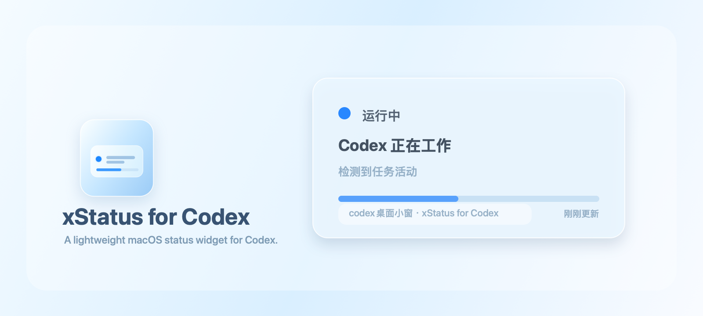

# xStatus for Codex

xStatus for Codex 是一个轻量的 macOS 菜单栏应用，用来在桌面上查看 Codex 当前任务状态。

它会在 Codex 状态变化时弹出一个小浮窗，显示任务是否正在运行、等待确认、已完成、失败或空闲。浮窗 5 秒后自动隐藏；如果你正在使用全屏应用，它不会主动弹出来打扰你。



## 功能

- 菜单栏常驻显示 Codex 当前状态。
- 状态变化时自动弹出桌面浮窗。
- 浮窗 5 秒后自动隐藏。
- 全屏应用前台运行时自动禁止弹窗。
- 支持显示当前项目/对话名称。
- 支持关闭菜单栏状态符号。
- Codex 应用启动后自动启动小组件。
- Codex 应用真正退出后，小组件也会自动退出。
- 每 3 秒轻量采集一次 Codex 本地状态。
- 状态未变化时不会重复写入，也不会反复弹窗。

## 状态

当前支持这些状态：

| 状态 | 含义 |
| --- | --- |
| `idle` | Codex 空闲 |
| `running` | Codex 正在工作 |
| `waiting` | Codex 等待用户确认或输入 |
| `completed` | 最近任务已完成 |
| `failed` | 最近任务失败 |
| `unknown` | 暂时无法判断状态 |

`completed` 用来提示最近一次任务刚刚完成；如果一段时间内没有新的 Codex 活动，状态会回到 `idle`。

菜单栏默认显示类似：

```text
Codex：运行中 ●
Codex：已完成 ✓
Codex：等待确认 ◐
```

## 安装

项目使用 Swift Package Manager 构建。

```sh
./scripts/install-codex-companion.sh
```

安装脚本会：

- 构建应用。
- 安装到 `~/Applications/xStatus for Codex.app`。
- 安装伴随启动服务。
- 安装状态采集服务。

安装后，只要 Codex 正在运行，xStatus for Codex 就会自动启动。

## 卸载

```sh
./scripts/uninstall-codex-companion.sh
```

卸载脚本会移除伴随启动服务、状态采集服务和支持目录。

如果你还想手动删除应用本体，可以删除：

```text
~/Applications/xStatus for Codex.app
```

## 本地试用

只构建应用：

```sh
./scripts/build-app.sh
```

构建结果：

```text
build/xStatus for Codex.app
```

构建并启动：

```sh
./scripts/run-app.sh
```

手动写入测试状态：

```sh
./scripts/write-status.sh running "Codex 正在工作" "检测到任务活动" 0.35
./scripts/write-status.sh completed "Codex 任务已完成" "最近一次任务已完成" 1
./scripts/write-status.sh waiting "Codex 等待确认" "检测到任务正在等待用户输入或授权" 0.75
./scripts/write-status.sh failed "Codex 任务失败" "检测到最近任务出现错误"
```

## 状态文件

应用读取这个状态文件：

```text
~/.codex/status-widget/status.json
```

状态文件示例：

```json
{
  "detail": "检测到任务活动",
  "progress": 0.35,
  "status": "running",
  "title": "Codex 正在工作",
  "updatedAt": "2026-06-02T15:59:58+08:00",
  "workspace": "codex桌面小窗 · 我需要你帮我..."
}
```

## 运行机制

xStatus for Codex 由三部分组成：

| 组件 | 作用 |
| --- | --- |
| macOS 应用 | 显示菜单栏状态和桌面浮窗 |
| Companion LaunchAgent | 每 15 秒检查 Codex 是否运行，并负责跟随启动/退出 |
| Collector LaunchAgent | 每 3 秒读取 Codex 本地日志，推断当前任务状态 |

状态采集器会读取 Codex 本地数据库中的事件类型和时间戳，用来判断当前状态。它不会依赖对话正文来判断状态。

## 隐私

xStatus for Codex 只在本机运行，不上传数据。

它会读取：

- Codex 是否正在运行。
- Codex 本地日志数据库中的事件类型、时间戳和线程信息。
- 当前线程的项目路径和标题，用于显示项目/对话标签。

它不会：

- 上传任何数据。
- 调用网络接口。
- 读取或发送你的完整对话内容。

## 资源占用

实际测试中：

- 菜单栏应用空闲 CPU 约 `0.0%`。
- 常驻内存约 `65-70MB`。
- 状态采集器每 3 秒运行一次，单次约 `0.1-0.2s`，运行后退出。
- Companion 每 15 秒运行一次，运行后退出。

## 已知限制

- 状态推断依赖 Codex 本地日志数据库和事件格式。如果 Codex 未来改变内部日志结构，采集规则可能需要更新。
- 这个项目目前面向 macOS 本地使用，没有做 App Store 分发、notarization 或正式签名。
- 图标和应用包适合本机使用；公开分发前建议补充正式发布流程。

## 开发环境

- macOS 14 或更高版本
- Swift Package Manager
- SwiftUI / AppKit

## 目录

```text
Sources/CodexStatusWidget/      macOS 应用源码
Resources/AppIcon.icns          应用图标
Resources/READMEBanner.png      README 横幅
scripts/build-app.sh            构建应用包
scripts/generate-app-icon.swift  生成应用图标
scripts/generate-readme-banner.swift
scripts/run-app.sh              本地构建并运行
scripts/install-codex-companion.sh
scripts/uninstall-codex-companion.sh
scripts/codex-status-collector.sh
scripts/write-status.sh
```
